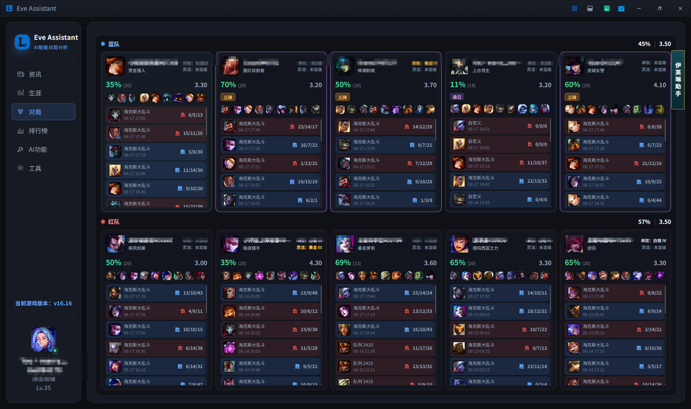
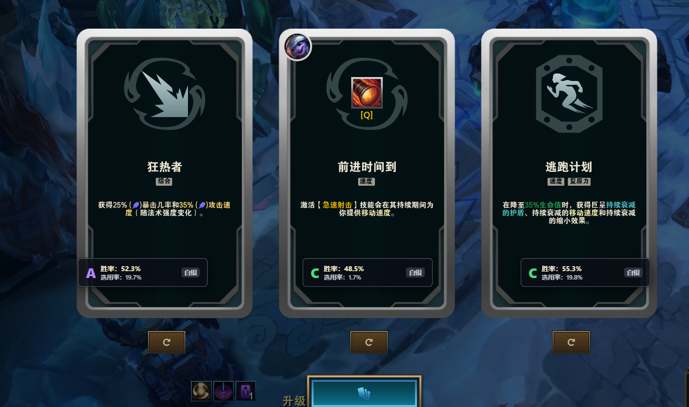
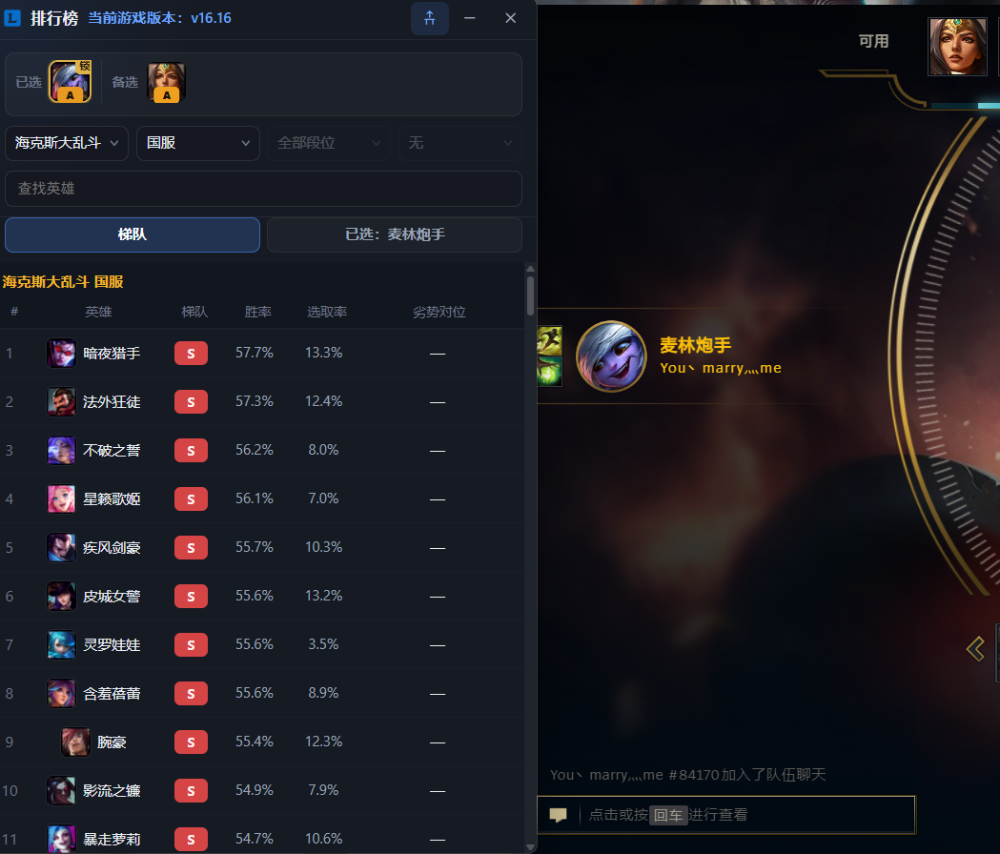
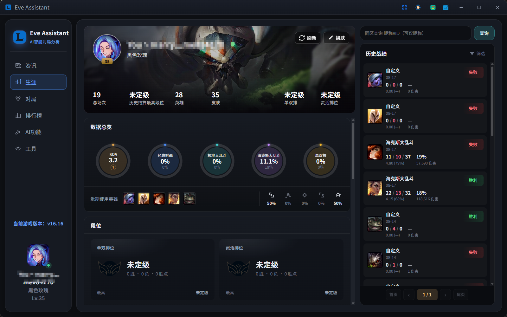
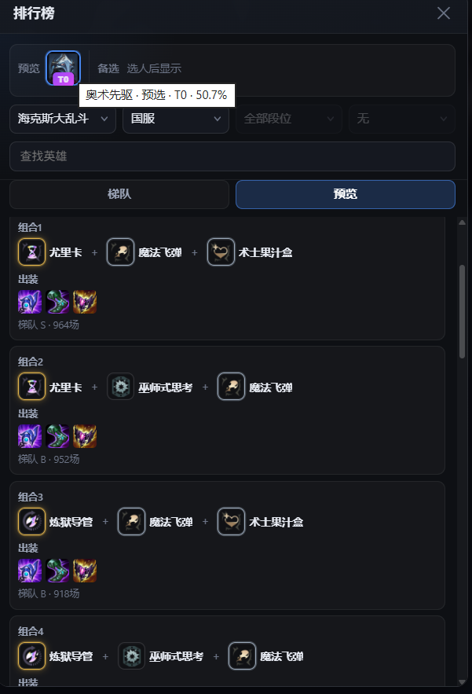
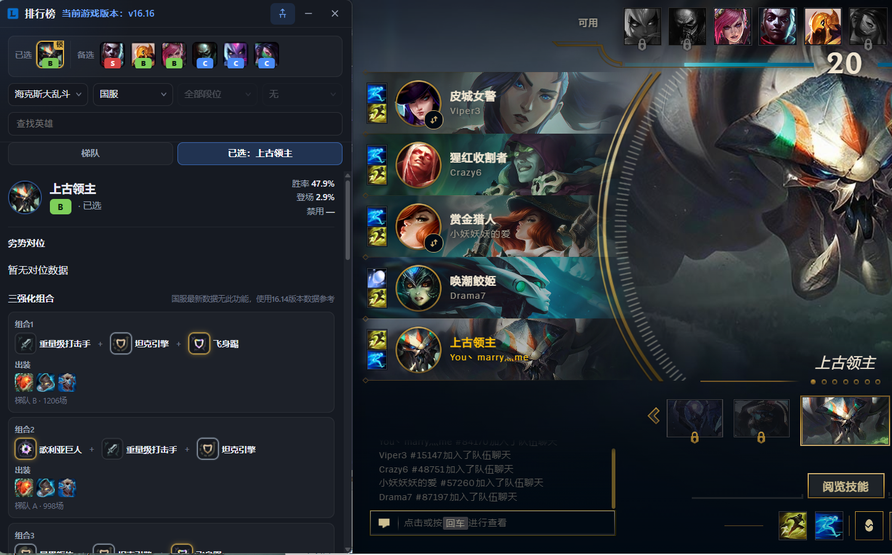

<div align="center">

# 👻 伊芙琳助手 · Eve Assistant

**《英雄联盟》海克斯大乱斗 & 峡谷对局的辅助工具**

实时覆盖层 · 海克斯评级 · AI 对局分析 · 网络数据同步 · 零云端上传

QQ交流群：1105114764

[](LICENSE)
[](https://www.python.org/)
[]()
[]()

[功能预览](#-功能预览) · [快速开始](#-快速开始) · [核心功能](#-核心功能) · [常见问题](#-常见问题) · [免责声明](#-免责声明)

⭐ **如果这个项目对你有帮助，欢迎 Star — 你的支持是我们持续维护的最大动力！**

</div>

---

## 📸 功能预览

<table>
  <tr>
    <td align="center" width="50%">
      
      <br><sub>对局分析 · 双方队伍数据对比</sub>
    </td>
    <td align="center" width="50%">
      
      <br><sub>海克斯评级 · S/A/B/C 实时推荐</sub>
    </td>
  </tr>
  <tr>
    <td align="center" width="50%">
      
      <br><sub>英雄排行榜 · 选英雄时 Overlay 展示</sub>
    </td>
    <td align="center" width="50%">
      
      <br><sub>个人生涯 · 多模式胜率统计</sub>
    </td>
  </tr>
  <tr>
    <td align="center" width="50%">
      
      <br><sub>三强化组合 · 出装与评级详情</sub>
    </td>
    <td align="center" width="50%">
      
      <br><sub>游戏内 Overlay · 选人与组合同步展示</sub>
    </td>
  </tr>
</table>

---

## 🚀 伊芙琳助手有哪些功能？

| 助手 | 伊芙琳LOL助手 |
|------|------------------|
| 海克斯三选一纠结 | **S/A/B/C 评级 + 组合推荐**，评出优先级 |
| 频繁切屏查战绩| **游戏内 Overlay**，数据就在眼前 |
| 不知道拿什么英雄 | **T0–T5 英雄梯队 + 胜率榜**，开局就有方向 |
| 担心辅助工具封号 | **本地OCR + 零云端上传**，数据不出本机 |
| 战绩分散难复盘 | **多模式战绩筛选 + 生涯总览**，一目了然 |

---

## ✨ 核心功能

### 🎯 对局助手

- **AI 智能对局分析** — 基于海量对局数据，实时输出趋势与英雄强度判断
- **海克斯评级系统** — 独创评级算法，快速识别当前强化优先级（S / A / B / C）
- **OP.GG 数据集成** — 同步韩服、欧服等网络数据胜率、登场率与最优出装
- **实时游戏覆盖层** — 无需 Alt+Tab，关键信息直接显示在游戏画面
- **本地识别** — 毫秒级响应，无网络延迟，隐私数据不上传

### 🏆 海克斯大乱斗专项

- **三强化组合推荐** — 按当前英雄推荐胜率最高的海克斯组合
- **英雄排行榜** — 海克斯大乱斗 T0–T5 梯队与详细数据
- **劣势对位分析** — 标注克制关系，帮你避开高风险对位

### 📊 战绩与数据

- **历史战绩** — 支持海克斯大乱斗、极地大乱斗、经典对战等模式筛选
- **个人生涯总览** — 总场次、胜率、KDA、常用英雄一屏汇总
- **多维数据面板** — 胜率 / 选取率 / 收益率，辅助每局决策

---

## ⚡ 快速开始

### 环境要求

- Windows 10 / 11
- 《英雄联盟》客户端（以实际支持为准）

### 安装

```bash
# 1. 克隆仓库
git clone https://github.com/a923878100/EveAssistant.git
cd EveAssistant

# 2. 启动）
下载打包好的 `.exe`，解压即用

```

> 📦 **不想配环境？** 前往 [Releases](../../releases) 下载打包好的 `.exe`，解压即用。
> **可选蓝奏下载:** https://wwbll.lanzoul.com/b002w4e43g


### 基本使用

1. 启动伊芙琳助手，按提示完成首次配置
2. 进入《英雄联盟》对局（推荐：海克斯大乱斗）
3. Overlay 会自动显示海克斯评级、推荐与对局分析
4. 对局结束后可在「战绩」页查看历史与统计

---


## ❓ 常见问题

<details>
<summary><b>Q：会被封号吗？</b></summary>

本工具采用**本地 OCR 识别**，不注入游戏进程、不修改游戏内存、不上传账号数据。但任何第三方工具均存在风险，请自行评估并在 [免责声明](#-免责声明) 范围内使用。
</details>

<details>
<summary><b>Q：支持 Mac / Linux 吗？</b></summary>

当前版本面向 **Windows** 平台。
</details>

<details>
<summary><b>Q：数据来源是什么？</b></summary>

英雄胜率、出装等数据集成自 **OP.GG** 等网络公开数据源；海克斯评级与组合推荐基于项目自研算法与对局样本。
</details>

<details>
<summary><b>Q：如何更新？</b></summary>

```bash
git pull origin main
pip install -r requirements.txt --upgrade
```

或关注 [Releases](../../releases) 下载最新版本。
</details>

---


## 📄 免责声明

> ⚠️ **重要提示**

- 本工具为**第三方辅助软件**，与 Riot Games 及《英雄联盟》官方**无任何关联**
- 使用本工具的一切后果由用户自行承担
- 请遵守 Riot 用户协议及当地法律法规，**禁止用于作弊、代练或其他违规行为**
- 本项目仅供学习与交流，请勿用于商业用途

---

## 📜 为爱发电

**QQ交流群：1105114764**

---

<div align="center">

**如果觉得有用，请点个 ⭐ Star，让更多人看到！**

Made with ❤️

</div>
